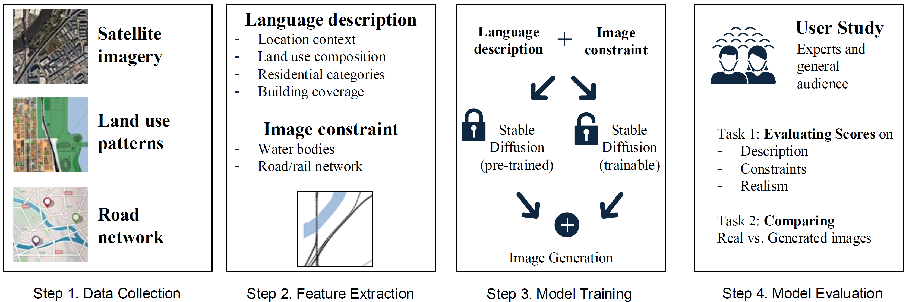

# Generative AI for Urban Planning: Synthesizing Satellite Imagery via Diffusion Models 
Qingyi Wang, Yuebing Liang, Yunhan Zheng, Kaiyuan Xu, Jinhua Zhao, Shenhao Wang

Implementation of https://arxiv.org/abs/2505.08833.
Scripts in [src](src/) consist of [Data Processing Workflow](img/data%20process.png) and [Model Train/Validation Workflow](img/training%20workflow.png).

**Abstract:** Generative AI offers new opportunities for automating urban planning by creating sitespecific urban layouts and enabling flexible design exploration. However, existing approaches often struggle to produce realistic and practical designs at scale. Therefore, we adapt a state-of-the-art Stable Diffusion model, extended with ControlNet, to generate high-fidelity satellite imagery conditioned on land use descriptions, infrastructure, and natural environments. To overcome data availability limitations, we spatially link satellite imagery with structured land use and constraint information from OpenStreetMap. Using data from three major U.S. cities, we demonstrate that the proposed diffusion model generates realistic and diverse urban landscapes by varying land-use configurations, road networks, and water bodies, facilitating cross-city learning and design diversity. We also systematically evaluate the impacts of varying language prompts and control imagery on the quality of satellite imagery generation. Our model achieves high FID and KID scores and demonstrates robustness across diverse urban contexts. Qualitative assessments from urban planners and the general public show that generated images align closely with design descriptions and constraints, and are often preferred over real images. This work establishes a benchmark for controlled urban imagery generation and highlights the potential of generative AI as a tool for enhancing planning workflows and public engagement.

## Proposed Framework

## Sample Generation

## Data Processing Workflow

## Model Train/Validation Workflow
